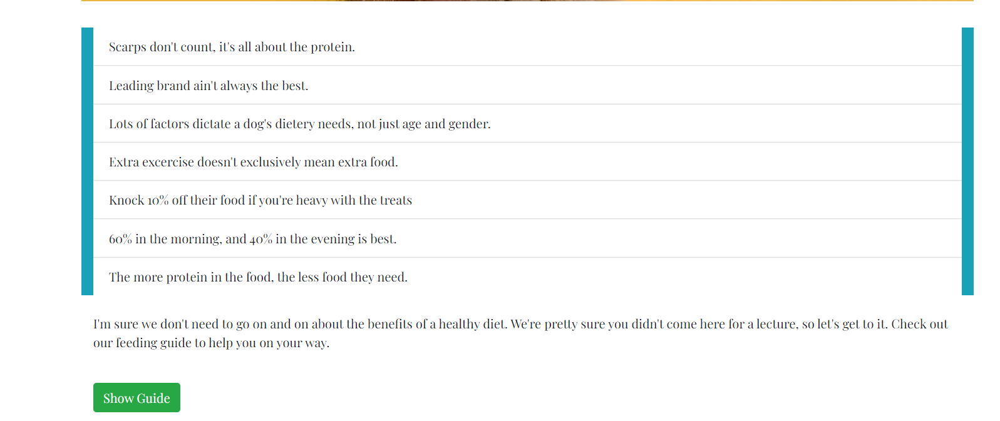
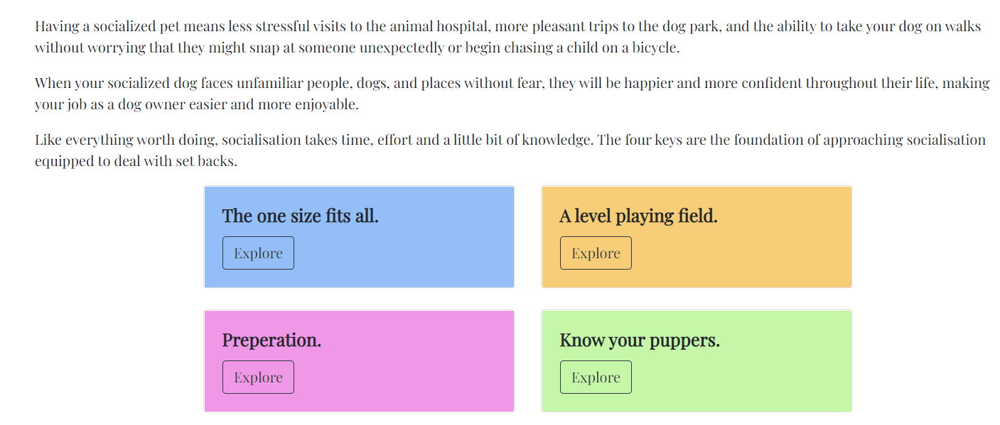
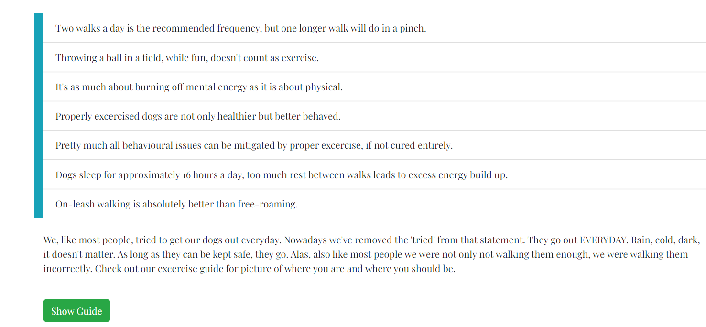
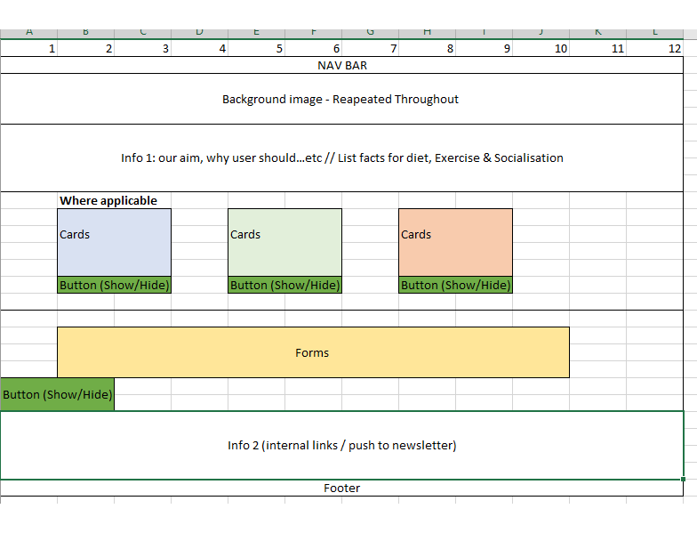

# Project Name: A better Puppers : (Never give up! Never surrender!)

## Project aim

The site's puprose is to provide information on general canine health. Be that physical, mental or social. Through a series of responsive questionaires we evalute dietery needs and optimal excercise duration.
We also provide 'the four keys' which address the most common mistakes involving socialising a dog.
The aim is to help onwers learn through simple changes they can make to their pets everyday life. 
There is a repeated drive for users to sign up to our newsletter for further engagement. 

What separates the site from others is our 'Pet First' approach. Above all else our goal is wider awaremness of the simple things we can all do to improve our pet's life. 

Our Secondary objective is to grow a community using added value and pulling from external partners to offer a varied range of services to those in need of more than the basic information. 

A live version can be found [here](https://firmodaniel.github.io/A-Better-Puppers/)

## Project Requirements
1. Dynamic Front End Project: Write custom JS, HTML, and CSS code to create a front-end application of more than one page with significant interactive functionality.
    * Achieved - The site has 5 pages. Index & Socialsation have minor JS, while Excercise and Feeding guide have more substantial interactivity via guides.
2. Site Responses: Use JS to have the site produce relevant responses dependant on users' actions.
     * Achieved - Both the feeding guide and excercise guide respond to user input selections from drop downs, and directly from typed input. 
3. Documentation: Write a 'README' file for your project that explains what the project does and the value it provides.
    * Achieved - Overview of project outline in the 'Project aim' section.
4. Write JS code that cycles through data and handles incoreect user entires, and store non-trival code in external sources using all applicale readability standards suchs as indentation and comments where needed. 
 * Achieved - Both guides deploy if/else loops and conditional responses via text messages or class changes depending on user interaction.
5. Design an implement manual testing with screen shots for verification, and fully document the project's start and end/ fully developed journey using a README.md file. 
 * Achieved - Manual testing is outlined below, and further testing/validation was carried out utilises W3C validators along with Chrome's lighthouse feature. 
6. Deploy finalised version to GitHub with clearly distinguishable comments where external sources were used. 
 * Achieved - deployed
7. All code must pass code validators such as W3C and Jshint.
    * Achieved - results in the validation section below.

## UX

#### Strategy & Scope planes
The website is targeted at dog owners in need of advice and initially directs them to the three most common problems.
* Weight issues.
* Energy levels.
* Behaviour.

The site offers simple first steps to tackle each issue and offers increased help if needed via social media pages.

In terms of scope the current site was kept conscise so as not to overwhelm already worried owners. 

## User Experiance 1
### Question: 
"My pet is over weight, even though I'm feeding him exactly what his food says I should."

### Answer: 
"The site provides some simple facts on feeding, and an interactive guide on how much the user's pet's protein needs with a further option to provide food weigh in grams based on the user's current food type."

## User Experinace 2
### Question: 
"My dog is overly agressive towards other dogs, regardless of their size, and I'm afarid they'll get hurt, or hurt someone else."

### Answer: 
"The site provides 'the four keys' to help with socialising your pet." The link for socialsation is displayed clearly on the landing page. 

## User Experiance 3
### Question: 
"I walk my dog everyday but they still have boundless energy, and when I leave them alone they destroy furniture and anythign else they can get a hold of."

### Answer:
"The site provides information on exercise utilising a list of facts, a snippet of our own experiance and a quick, helpful guide to demonstrate how long a dog should be walked based on some user inputs."

### Wireframes
#### The Structure & Skeleton planes
In keeping with the uncomplicated approach agreed upon in our Scope plane, the initial wireframes were created
with consistency in mind so each advancing page's style follows the previous.

## Features
### The Surface Plane
Overall the site is responsive and scales with user screen size. 

The site follows a correlating scheme or colours (Custom Purple #f75ce8, Custom Blue #93bef7, Cutsom Green #c6f7a9, Custon Orange #f7ce77 and some bootstrap basics like primary, info and success classes ).
These colours are interchanged periodically to avoid visual fatigue. 

### Existing Features
* Header : Navigation collapse when needed on smaller screens so as not to clutter mobile decives. An active class is appled to current user pages. 
* Index : The welcome message changes depending on the time of the day. Colourful cards are deployed to draw the users attention.   
* Excercise : Firstly we debunk commonly held beliefs, and provide an interactive guide. Utilising Jquery for show/hide, text changes and calculations.
* Socialsation: Again we utilise cards to organise the four keys to successful socialisation. Utilising Jquery for show/hide and text changes.
* Feeding Guide: Mirroring the Excercise page, we debunk misnomers and provide an interctaive guide. Utilising Jquery for show/hide, text changes and calculations.
* Contact Us : We outline our newsletter benefits and proivide a sign up form with working Email.js.
* Footer : Links provided to fictional social medias.

### Features left to implement 
* A large form which encompasses diet, excercise and some socialisation tricks which would take longer to fill out but may yield better user results. 
* A shop element to utilise refferal links for equipment, toys and books reviewed and rated by our social media community. 

## Technologies used
* HTML-For basic structure.
* CSS-For styling and required Media Query outside of Bootstrap.
* JavaScriprt 
* [Email.JS](https://www.emailjs.com/)
* [Jquery](https://jquery.com/)
* [W3C validator](https://validator.w3.org/)-Used in testing HTML and CSS.
* [JsHINT](https://jshint.com)-Used for Java Script validation.
* [GitHub](https://github.com) -For deployment.
* [GitPod](https://www.gitpod.io/) -IDE.
* [Bootstrap (including JQuery)](https://getbootstrap.com) -Utilized for responsiveness via columns, buttons and navbars.
* [Google Fonts](https://fonts.google.com) -Used for primary font employed throughout. [Lato]('https://fonts.googleapis.com/css2?family=Lato&display=swap').
* [Visual Studio](https://code.visualstudio.com) -For offline work.
* [Font Awesome](https://fontawesome.com/)  - For icons.
* Google Chrome's Responsive Viewer found [here](https://chrome.google.com/webstore/detail/responsive-viewer/inmopeiepgfljkpkidclfgbgbmfcennb)
* Google Chrome's lighthouse function.

## Testing
### Links
#### Manual Testing
* Header Links
    *  Header links are housed in a BootStrap Nav Collasable Bar on each page.
        *  Home
        *  Excercise Guide
        *  Socialsation (The Four Keys)
        *  Feeding Guide
        *  Contact Us
    * _All links when selected lead to the assigned pages._

* Footer Links
    *  Footer links are housed in a Bootstrap Container to ensure correct sizing. Font size is set to zero using media queries so the footer remains neat on small screens.
        *  FaceBook 
        *  Twitter
        *  Instagram
        *  Donate
    * _All links open in a new tab as expected._

* Index Page
    * Contains eight internal links mirroring the options available from the navigation bar.
        *  Diet
        *  Excercise
        *  Socialsation
        *  Contact Us
    * _The links when selected navigates the user to the intended pages._

  
### Guides / Forms
#### Manual Testing
* Guides / Forms are found on both the Excercise Guide page and the Feeding Guide page. 
    * Exercise Guide
        * The Gender, and Neutered inputs are optional, though both create response based messages when selected.
        * For Example on the Feeding Guide 'Oh who's a good boy !' appears if male is selected. (Text colour changes via AddClass methods based on gender)
        * A selected Gender also shows a hidden input requesting the pet's name. Once populated the following questions are populated with the inputted name.
        * If a Neutered option is selected it creates two messages (coloured again depending on selection)
        * The first appears under the Neutered option. The second appears only once a weight option is selected.
        * The weight input is required for any output in the final line. Upon selection it populates the final output with a custom response based on input in the form of minutes per day.
        * Resseting Gender and Neutered to the 'make selection' options removes generated messages and the name option input box, but does not clear any previously inputted name.
        * The reset button removes all entries and added classes. 
        * The Neutered option also influences the Final output by reducing the minutes needed by 10%. A message further conveys this to the user. 
    * Feeding Guide
        * As with the excercise guide both Gender and Neutered options are not required for calculations, but both create custom messages, while only gender may influence the final output by 10% up or down.
        * Upon gender selction a new input is shown which requests the pet's name, this input is then used to customise the following questions.
        * The weight option is required for the Daily Protein needs output to user.
        * Food bag size, and current protein range, as well as weight, are both required to populate the Final output.
        * Populating just bag size, or just protein range, or both will not generate any output. A weight selection is needed. 
        * Populating a weight selction, and either bag size OR protein range will not generate a final output. 

### Responsiveness
#### Screen sizes
I used Google Chrome's Responsive Viewer found [here](https://chrome.google.com/webstore/detail/responsive-viewer/inmopeiepgfljkpkidclfgbgbmfcennb).
The following are exerts from three tests.

##### Test @ 300 x 576
[300*576](screenshots/responsive300x576.png)

##### Test @ 320 x 635
[320*635](screenshots/responsive320x635.png)

##### Test @ 1024 x 800
[1024*800](screenshots/responsive1024x800.png)

### Performance
##### Lighthouse overall results 

| Page    | Performance  | Accessibility  | Best Practise  | Seo |
|---|---|---|---|---|
| Index  | 93  | 93  | 100  | 90  |
| Exercise Guide| 94  | 96  | 100  | 78  |
| Socialsation | 93  | 93  | 100  | 78  |
| Feeding Guide | 93  | 96  | 100  | 78  |
| Contact Us | 93  | 84  | 100  | 89 |

_Note_: Lighthouse proposed other fixes but most were beyond my capability. 

### Validation
Using [W3C validator](https://validator.w3.org/) both HTML and CSS were checked by direct input. Issues arising were promptly corrected. 

    

Using [JShint](https://jshint.com)
* First run showed 51 warnings
* Second run showed 46 warnings relating to the use of 'let' to declare variables and the use of template literal's for older versions. The script was not amended to address these, as I wasn't sure how relevant the warnings were.

## Deployment
The project was developed using [GitPod](https://www.gitpod.io/) workspace, committed to git and pushed to [GitHub](https://github.com) using the built in function within Gitpod.
To deploy this page from the [GitHub respository](https://github.com/FirmoDaniel/A-Better-Puppers), the following steps were taken.
1. Log in to **GitHub**.
2. From the list of repositories on screen select 'A-Better-Puppers'.
3. Select **Settings** from the menu.
4. Scroll down to **GitHub Pages**
5. Under **Source** click the dropdown menu labelled **none** and select the **Master Branch**.
6. On selecting **Master Branch** the is automatically refreshed, the website is now deployed.
7. A link can be found in the **GitHub pages section**, and also in the about section within **A-Better-Puppers**.
8. [Link to site](https://firmodaniel.github.io/A-Better-Puppers/)

### Cloning
1. Go to GitHub Repository: [A-Better-Puppers](https://github.com/FirmoDaniel/A-Better-Puppers)
2. Select 'Code' dropdown button (next to green 'gitpod' button).
3. These are your three options **Clone-Options**.

    * Copy the URL to your local IDE such as [Visual Studio](https://code.visualstudio.com).
    * Intsall [GitHub desktop](https://desktop.github.com/).
    * Download the Zip file and use with local IDE such as [Visual Studio](https://code.visualstudio.com).

## Credits
### Content
* Some text was taken from the following sites.
    * [link for exercise text](https://jetpetresort.com/blog/dog-care/the-importance-of-exercising-your-dog/#:~:text=Exercising%20keeps%20your%20dog%20healthy,you%20and%20in%20their%20environment.)
    * [Link for Socilaisation text](https://www.reedanimalhospital.com/the-benefits-of-socializing-your-dog/#:~:text=Socializing%20teaches%20your%20dog%20how,both%20you%20and%20your%20dog.)
    * [Link for diet text](https://pets.webmd.com/dogs/guide/diet-nutrition)

### Media
* [Background Image](https://images.unsplash.com/photo-1583512603805-3cc6b41f3edb?ixlib=rb-1.2.1&ixid=MXwxMjA3fDB8MHxleHBsb3JlLWZlZWR8NXx8fGVufDB8fHw%3D&auto=format&fit=crop&w=500&q=60)
* [Index:German Shepherd](https://images.unsplash.com/photo-1555573710-118d1049ed07?ixid=MXwxMjA3fDB8MHxzZWFyY2h8MTZ8fGdlcm1hbiUyMHNoZXBoZXJkJTIwZG9nfGVufDB8fDB8&ixlib=rb-1.2.1&auto=format&fit=crop&w=500&q=60)

